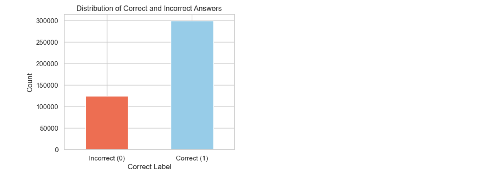
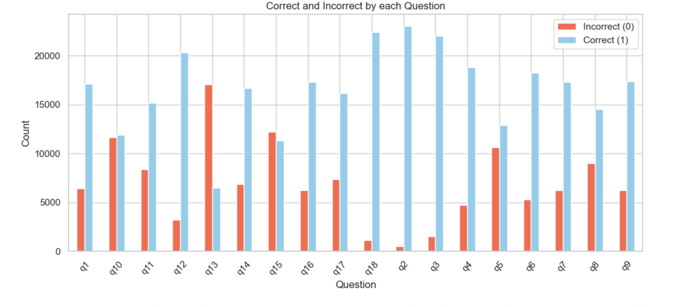
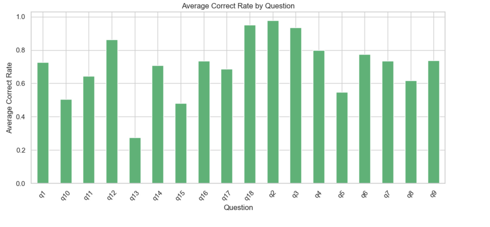

# Predicting Student Performance from Gameplay Data

This project uses the Kaggle “Predict Student Performance from Game Play” dataset to build a machine learning model that predicts whether a student will answer a question correctly based on gameplay interaction data. The dataset contains student gameplay events, including clicks, elapsed time, level progress, and session information. Since the original dataset is event-level data, the information was cleaned and transformed into session-level features that could be used for machine learning.

## Project Overview

The main goal of this project is to predict student performance from gameplay behavior. In this project, student performance is treated as a binary classification problem, where the model predicts whether an answer is correct or incorrect. A correct answer is represented as ⁠ 1 ⁠, while an incorrect answer is represented as ⁠ 0 ⁠.

The raw gameplay dataset contains a large amount of detailed interaction data. Each row represents a specific gameplay event, but machine learning models work better when the data is summarized into useful features. Because of this, the gameplay data was grouped by ⁠ session_id ⁠ and ⁠ level_group ⁠. Features such as average elapsed time, maximum level reached, and total number of interactions were created to represent each student’s gameplay behavior during a specific part of the game.

## Data

The dataset used in this project comes from the Kaggle “Predict Student Performance from Game Play” competition. It contains gameplay event data and labels showing whether students answered questions correctly or incorrectly. The main gameplay file contains millions of rows, so the project focuses on cleaning, filtering, and transforming the data into a smaller and more useful format for modeling.

The target variable is the ⁠ correct ⁠ column from the labels dataset. This column tells whether the student answered a question correctly. The input features were created from gameplay behavior, including time-based information, level progress, and interaction counts. After preprocessing, the dataset was prepared so that each row represented a student session and level group, making it easier to train and evaluate the machine learning model.

## Data Visualization

Data visualization was used to understand the student performance patterns before training the machine learning model. The first visualization shows the overall distribution of correct and incorrect answers in the dataset. This helped identify whether the dataset was balanced or if one class appeared more often than the other.

The second visualization compares correct and incorrect answers for each question. This graph is useful because it shows that some questions have higher correct rates than others. Questions with more correct answers may be easier for students, while questions with more incorrect answers may be more difficult.

The third visualization shows the average correct rate for each question. This gives a clearer view of student performance across different questions. A higher average correct rate means students answered that question correctly more often, while a lower average correct rate suggests that the question was more challenging.

These visualizations were important because they helped explain patterns in the target variable before modeling. They also showed that question difficulty and student gameplay behavior may both play a role in predicting whether a student answers correctly.

## Data Preprocessing and Feature Engineering

Before training the model, the raw gameplay data had to be prepared. Since the original dataset was based on individual gameplay events, it was not directly ready for machine learning. The data was grouped by ⁠ session_id ⁠ and ⁠ level_group ⁠ so that each row represented a meaningful gameplay segment for a student.

Several session-level features were created from the event data. These features included average elapsed time, maximum level reached, and total number of gameplay interactions. These engineered features helped summarize student behavior in a way that the machine learning model could understand.

After feature engineering, the target labels were connected to the prepared gameplay features. The final dataset was then split into training and validation sets. The training set was used to teach the model, while the validation set was used to evaluate how well the model performed on data it had not seen during training.

## Model Used

A Random Forest classifier was used for this project. Random Forest is a machine learning model that builds many decision trees and combines their results to make a final prediction. This model was selected because it works well for classification problems and can handle many different types of features.

The Random Forest model was trained using the prepared session-level gameplay features. The model learned patterns between student gameplay behavior and whether the student answered correctly. After training, the model was tested using the validation dataset.

## Model Evaluation

The model was evaluated using accuracy, classification report, and ROC AUC score. Accuracy measures how often the model predicted the correct class. The classification report gives more detailed information about precision, recall, and F1-score. The ROC AUC score shows how well the model separates correct and incorrect answers across different probability thresholds.

The Random Forest model achieved about 62% validation accuracy and a ROC AUC score of about 0.64. This means the model performed better than random guessing, but there is still room for improvement. The result suggests that gameplay behavior contains useful information for predicting student performance, but stronger features and additional modeling strategies could improve the prediction quality.

The ROC curve below shows how well the Random Forest model separates correct and incorrect answers. A curve farther away from the diagonal line indicates better model performance.

## Future Work

In the future, I would love to improve this project by creating stronger features, such as question-specific behavior and spending more time over each questions .I would also love to try different models with other available datasets.
